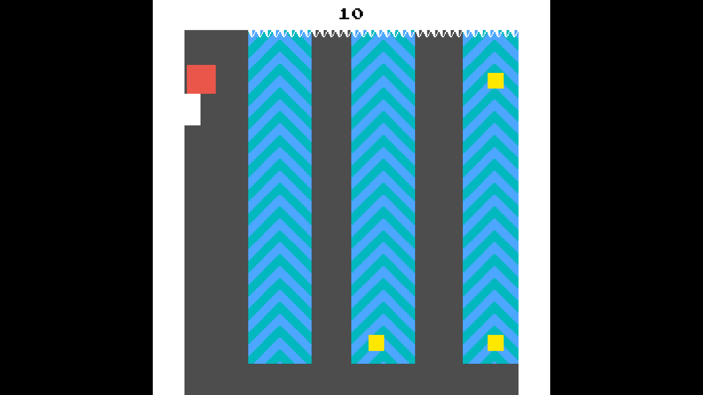

# Welcome to my GitHub page 
Hello, my name is Tiago and I'm currently studing at ETML.

### :fire: Principal Project

<table>
  <tbody>
    <tr>
      <td>
        
      </td>
      <td>
        
      </td>
    </tr>
    <tr>
      <td>
        <a href="https://jicoco.itch.io/10-seconds-to-run">10 seconds to run</a>
      </td>
      <td>
        <a href="https://github.com/TiaSous/Plot-That-Line">Plot-That-Line</a>
      </td>
    </tr>
  </tbody>
</table>

### :hammer_and_wrench: Languages and Tools :

<table>
  <tbody>
    <tr>
      <td>
        &nbsp;
      </td>
      <td>
        &nbsp;
        &nbsp;
        &nbsp;
      </td>
      <td>
        &nbsp;
      </td>
      <td>
        &nbsp;
      </td>
    </tr>
    <tr>
      <td>
        <ul>
          <li> <a href="https://github.com/TiaSous/Plot-That-Line">Plot-That-Line</a></li>
          <li> <a href="https://github.com/TiaSous/Projet_SpaceInvaders">Space Invaders</a></li>
          <li> <a href="https://github.com/TiaSous/Sudoku-Solver">Sudoku Solver</a></li>
        </ul>  
      </td>
      <td>
        <ul>
          <li> <a href="https://github.com/TiaSous/Snake-JS">Snake JS</a></li>
          <li> <a href="https://github.com/TiaSous/P-Secured-Webshop">Secured Webshop</a></li>
        </ul>
      </td>
      <td>
        <ul>
          <li> <a href="https://github.com/TiaSous/347-docker-swarm-wordpress">Swarm WordPress</a></li>
        </ul>
      </td>
      <td>
        <ul>
          <li> <a href="https://github.com/TiaSous/P-295-API">Lecture</a></li>
        </ul>
      </td>
    </tr>
  </tbody>
</table>

---

